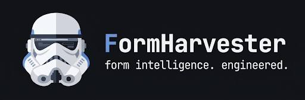

FormHarvester is an AI-assisted form intelligence engine.
It navigates the open web autonomously - executing searches, parsing page structure, extracting contact signals, and interacting with forms at the browser level. Built on async browser with stealth fingerprinting, proxy rotation, and a pluggable captcha solver interface.

## Adjusting config.txt

#### `mode`
The CSV that will be used by the bot (e.g. `mode = lawn` will use `lawn.csv`)

#### `max_google_pages`
The CSV that will be used by the bot (e.g. `mode = lawn` will use `lawn.csv`)

#### `skip_ads`
FormHarvester will skip any ads on Google Search.

#### `start_page`
FormHarvester will start on X google page.

#### `send_form`
FormHarvester will send the form inside the website. It can be disabled to save time.

#### `generate_email_sources`
Generate an extra file showing the source URL where the email was extracted.

#### `hide_browser`
This setting will run the browser in headless mode and it will be hidden.

#### `max_time`
Max time FormHarvester can spend on a single website.

#### `min_delay` and `max_delay`
A random delay between `min` and `max` will be used for google.

#### `captcha_sleep`
Sleep for `X` minutes after a Google captcha is found. 0 to disable.

#### `search_timer`
A waiting time (in minutes) between the last google search and the next one.

#### `[captcha]`
Here you can enter deathbycaptcha credentials to solve captchas automatically.

#### `[dev]`
Disable in production. They are used for development reasons. `debug_form` may be useful, as it prevents the form from submitting.

## How to run
#### Executable
`Run formharvester.exe`

#### Python
`pip install -r requirements.txt`

`python3 bot.py`

## Folder structure

#### data
Where scraped emails and logs are dumped.

#### drivers
Browser drivers used by selenium.

#### input
Input CSV files go here.

#### log
This folder will report errors on websites, very useful to improve the bot.

___

This project is released under the [MIT License](LICENSE). You are free to use, modify, and distribute this software, provided that the original copyright notice and license terms are included in all copies or substantial portions of the software.
